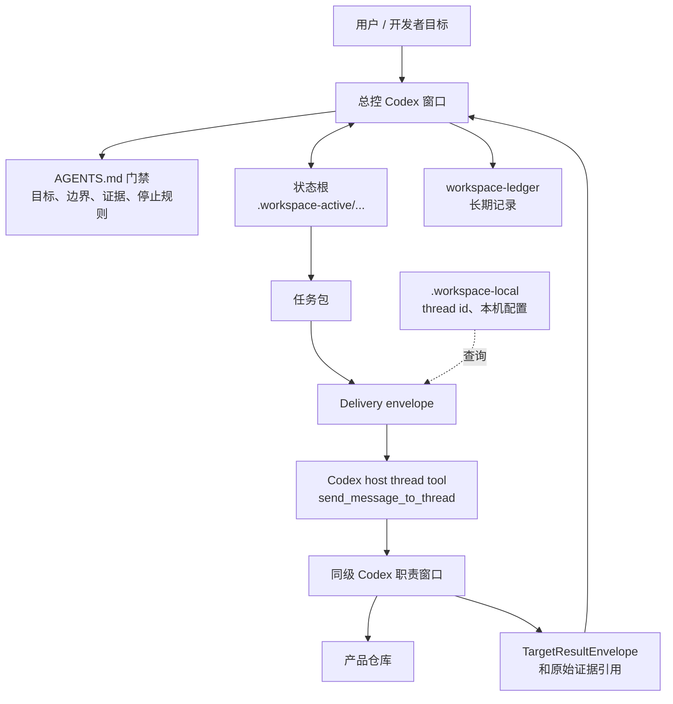

<div align="center">

# Codex Control Workspace

一个本地优先的 Codex 多仓库总控面：一个总控窗口，多个职责窗口，明确证据，direct-thread 投递，但不把脚本变成裁决者。

[English](README.md)

</div>

---

- [它解决什么](#它解决什么) · [基础架构](#基础架构) · [安装形态](#安装形态) · [工作如何流动](#工作如何流动) · [自动化模型](#自动化模型) · [日常使用](#日常使用) · [目录职责](#目录职责) · [设计哲学](#设计哲学)

## 它解决什么

一个 Codex 窗口很适合处理一个仓库。真实产品需求经常同时跨过插件入口、本地 daemon、共享 core、Dashboard、需求设计窗口和真实项目测试窗口。Codex Control Workspace 的作用，是防止这些工作散成一堆聊天上下文。

核心亮点：

- **一个总控大脑**：父级工作区统一接收目标、判断边界、分派任务、验收证据、归口 TODO 和归档。
- **一个需求一个状态根**：机器状态、任务包、目标结果和 review candidate 放在同一个 state root 里，而不是散落在状态文档里。
- **一个开发者可读推进面**：`developer-progress.md` 承载目标、完成定义、阶段方案、任务包、回填摘要和总控裁决。
- **同级 Codex 窗口保持专职**：产品仓库保留自己的规则、提交、测试和职责边界。
- **direct-thread 只负责运输**：packet 可以在 Codex 窗口之间移动，但总控仍必须读取原始证据后再验收。
- **Design 和 Test 挂到需求上**：需求设计 handoff 和真实场景 test card 成为结构化 intake，不再各自发展一套并行状态机。
- **本地优先**：活跃状态和真实 thread id 不进 Git；长期决策进入项目 ledger。

它不是更大的脚本运行器，而是一个小而清楚的控制面，让多窗口、多仓库工作里的判断、证据和责任持续可见。

## 基础架构



只有总控能决定证据是否足够。脚本负责创建、校验、汇总和记录机器数据；脚本不验收功能、不扩大范围、不替用户决定产品行为。

## 安装形态

不要把产品仓库塞进这个仓库里。推荐把通用总控仓库放在项目族父目录下，和它管理的仓库并列：

```text
MyWorkspace/
  AGENTS.md                  # 解包后的总控入口
  codex-control-workspace/   # 本通用仓库
  ProductRepo/
  CoreRepo/
  PluginRepo/
  DesignRepo/
  TestRepo/
  workspace-ledger/          # 项目专属长期账本
```

`workspace.config.json` 提供可复用默认配置。真实本机安装可以用 `.workspace-local/workspace.config.json` 覆盖；这个文件永不提交。`.workspace-active/` 和 `.workspace-local/` 是运行态，不是产品源码状态。

推荐安装方式：

1. 让 Codex 先探测父目录。
2. 让它建议仓库职责和窗口名。
3. 由你确认边界。
4. 再让它只写入受管理的 `AGENTS.md` 区块和本地运行面。

可以从这段提示词开始：

```text
你是 codex-control-workspace 安装助手。
先读取 README.md、README.zh-CN.md、AGENTS.md、workspace.config.json、scripts/README.md。
对同级仓库做只读探测。
列出建议窗口名、仓库职责、已有 AGENTS.md 状态，以及将创建的本地运行面。
等待我确认后再写入任何文件。
```

## 工作如何流动

正常闭环故意保持朴素：

1. 用户提出目标，或 Design 窗口交回 handoff。
2. 总控明确完成定义、边界、第一阻塞点和可执行仓库。
3. state root 记录需求并创建任务包。
4. 目标 Codex 窗口收到轻量 direct-thread prompt。
5. 目标窗口只在自己的仓库职责内执行，并用 result envelope 回填证据引用。
6. 总控读取原始证据，接受或打回，并记录裁决。
7. 总控继续派发下一可领取任务、标记阻塞、等待用户裁决，或完成归档。

Design 和 Test 是支持角色：

- **Design** 负责澄清需求、取舍、隐藏目标和 handoff 候选；只有被用户或总控接收后，才成为正式产品事实。
- **Test** 负责真实项目、Dashboard、cold-start、runtime 等总控或产品仓库无法安全自测的证据。

## 自动化模型

自动化就是 direct-thread 投递加结果回跳。它不是隐藏调度器，也不是验收替代品。

核心规则：

- 真实 Codex thread id 只保存在 `.workspace-local/`。
- 投递提示词保持短小、可读。
- host thread tool 负责真实发送；脚本只记录 send/readback 证据。
- `group-ready` 可以等所有预期窗口都有结果后，一次性回调总控。
- `per-target` 可以每个目标完成时唤醒总控，但仍携带 group snapshot。
- 总控在最终完成、硬门禁、用户停止、无可领取 TODO、证据不足或当前状态禁止派发时停止。

如果需要完整参数和命令，读 [scripts/README.md](scripts/README.md)。README 只解释控制模型，不当 shell 手册。

## 日常使用

先读当前总控面和当前 state root，不要上来跑一串脚本。最常用的辅助命令是：

```sh
node scripts/workspace-control.mjs status
```

然后选择能推进真实闭环的最小动作：

- 接收 Design handoff 或 test card；
- 创建或派发一个任务包；
- 导入目标窗口结果；
- 归约结果并做总控裁决；
- 证据和 TODO 都收束后再归档。

脚本家族：

| 需要做什么 | 脚本家族 |
| --- | --- |
| 安装 / 同步父级与子仓库 `AGENTS.md` 管理块 | `control-workspace-install.mjs` |
| 创建 state root、任务包、裁决和 progress 投影 | `controller-state.mjs` |
| 记录 Design / Test intake | `control-intake.mjs` |
| 创建 delivery envelope、review result group、记录 direct-thread run | `codex-automation-loop.mjs` |
| 日常状态、验证和命令快捷入口 | `workspace-control.mjs` |

## 目录职责

| 路径 | 作用 |
| --- | --- |
| `AGENTS.md` | 总控规则源文件，用于解包到父级工作区。 |
| `workspace.config.json` | 通用窗口名、同级仓库路径、职责标签和脚本默认配置。 |
| `.workspace-active/` | 不提交的项目运行态：当前索引、状态根、推进文档、TODO 投影、intake、test cards。 |
| `.workspace-local/` | 不提交的本机运行态：真实 thread id、自动化闭环状态、keep-live 状态、本机配置覆盖。 |
| `../workspace-ledger/` | 位于本仓库外的项目专属长期账本。 |
| `scripts/` | 安装、校验、账本、状态机、intake、自动化和总控辅助脚本。 |
| `skills/` | 总控、子窗口、测试、账本和自动化操作手册。 |
| `templates/` | 状态根、开发者推进文档、Design/Test 支持面和阶段确认的最小骨架。 |

## 设计哲学

1. **判断留在总控**：脚本输出、窗口回填、TODO 行和状态文档都是证据，不是验收。
2. **一个需求一个机器状态根**：重复状态和 envelope 使用 JSON / JSONL，Markdown 保持可读上下文和证据。
3. **一个可读推进面**：开发者不应该翻五个状态文件才知道目标和下一阻塞点。
4. **自动化移动工作，不移动权力**：direct-thread 投递只能证明提示词已发送，不能证明任务已完成。
5. **仓库职责不能混**：shared contract、插件入口、daemon 行为、Dashboard UI、Design 和 Test 都留在正确窗口。
6. **小提示词优于命令大全**：目标窗口需要当前任务、state root、skill 和身份规则，不需要完整脚本手册。

Codex Control Workspace 是多窗口协作的脚手架。它的工作，是让真正的决策点难以被跳过。
